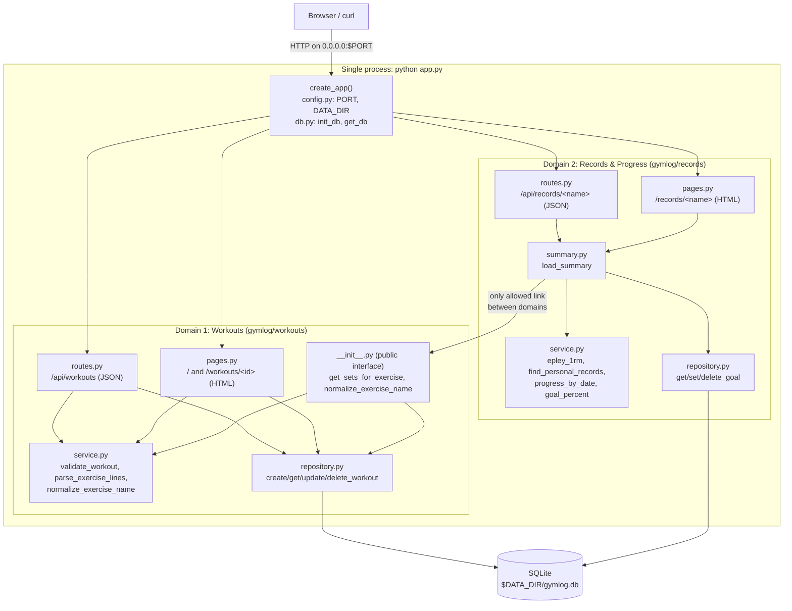
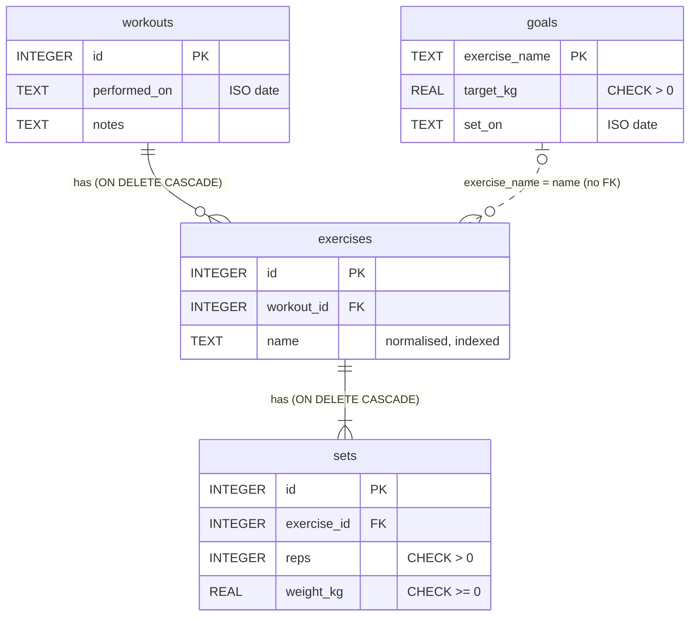

# Gym Log diagrams

Both diagrams match the code as of 2026-10-03. GitHub renders the Mermaid blocks below.

## Architecture

One Python process started by `python app.py`. `create_app()` loads config from environment
variables, runs `init_db` (creates all tables), and registers four blueprints, two per domain.
Each domain is split into routes/pages (HTTP), `service.py` (pure logic) and `repository.py` (SQL).
The records domain reaches workouts data **only** through the public interface in
`gymlog/workouts/__init__.py` (ADR-2).

## Database schema

Created on startup from `gymlog/workouts/schema.sql` and `gymlog/records/schema.sql` (ADR-3).
`goals` belongs to the records domain and has **no foreign key** into the workouts tables: it is
matched to exercises by the normalised name, so records could move to its own database later.

